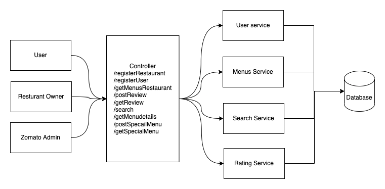

##

### Function Requirements 🤔
 * Onboard a Restaurant
 * Onboard an User
 * Menus management of a Restaurant
 * Search by Restaurant or Menu
 * Rating and review
 * Special Menus management

### HLD

### Class Diagram

### Database Management Selection 👈
    
#### 1. PostgreSQL(Selected) 
* Provide Full text search capabilities Free
* Provide linguistic support
* Uses Vector Space Model
* Convert documents to text to ts_vector
* Support two types of Index on ts_vector
  * GIN(Generalized Inverted Index)
    * Write slow
  * GiST(Generalized Search Tree)
    * Write fast
* Restaurant problem it is suitable choice as data are structured 

#### 2. MongoDB
* Support Full text search with premium service MongoDB hosted at Atlas
* Support Legacy Full text search with no Linguistic Support
* Uses Text Index on the field to being search
* Provide Linguistic support by Atlas MongoDB

#### 3. MySQL
* Support full text search using FULLTEXT index
* Write slow
* Doesn't support Linguistic by default

